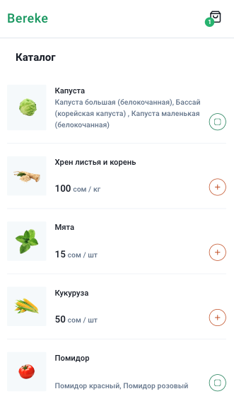
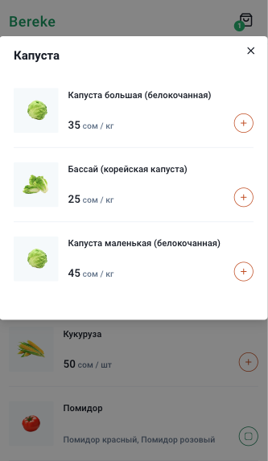
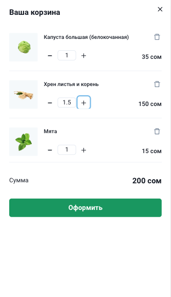
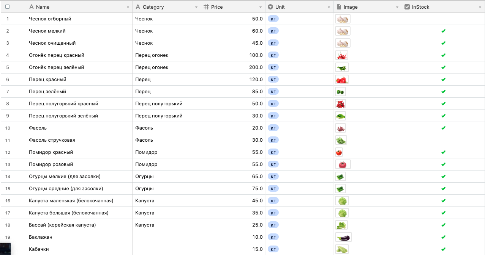

This is a [Next.js](https://nextjs.org/) project bootstrapped with [`create-next-app`](https://github.com/vercel/next.js/tree/canary/packages/create-next-app).

## Getting Started

First, run the development server:

```bash
npm run dev
# or
yarn dev
```

## Tech stack

-  Chakra UI
-  Next JS
-  Airtable
-  Jotai

#### Menu



#### Category



#### Cart



#### Airtable table


